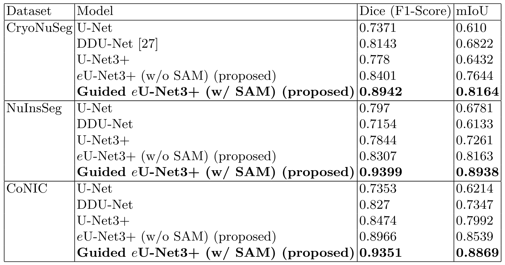

<br/>
<div align="center">
  
</div>

<p align="center">
  <h3 align="center">SAM Guided Task-Specific Enhanced Nuclei Segmentation in Digital Pathology</h3>

  <p align="center">
    Official implementation of the paper published at MICCAI 2024
    <br/>
    <br/>
    <a href="https://github.com/CVPR-KIT/SAM-Guided-Enhanced-Nuclei-Segmentation/issues">Report Bug</a>
  </p>
</p>

</p>

<div align="center">
  <h3> Qualitative Performance Comparison </h3>
  
</div>


<div align="center">
  <h3> Quantitative Performance Comparison </h3>
  
</div>

***

## Setup
1. Clone the repository:
    ```bash
    git clone https://github.com/CVPR-KIT/SAM-Guided-Enhanced-Nuclei-Segmentation.git
    ```
2. Create a new environment and install the required packages:
    ```bash
    pip install -r requirements.txt
    ```
## Dataset
Three datasets are used in the experiments.
1. [CryoNuSeg](https://github.com/masih4/CryoNuSeg)
2. [NuInsSeg](https://github.com/masih4/NuInsSeg)
3. [CoNIC](https://conic-challenge.grand-challenge.org/) 

The datasets are chosen for their diversity in staining methods and tissue complexity. CryoNuSeg includes a collection of 30 images, NuInsSeg contains 665 image patches, and CoNIC contains 4981 images in the dataset.

## Directory Configuration
The datasets can be organised using [organize_dataset.py](auxilary/organize_dataset.py) and followed up with [genAugmentation.py](genAugmentation.py) to generate augmnetations. the code file [genSAMEncoding.py](genSAMEncoding.py) can be used to obtain SAM encodings of the images that is to be used during the experiments.
The final structure of dataset directory configuration should look something like the following. 

```
NuInsSeg/
  ├── test/
  │   ├── 0.png (input image)
  │   └── 0_label.png (groundtruth image)
  │   └── 0_en.pt (SAM encoding)
  ├── train/
  │   ├── 0.png
  │   └── 0_label.png
  │   └── 0_en.pt 
  └── val/
  │   ├── 0.png
  │   └── 0_label.png
  │   └── 0_en.pt 
```
Each of the directory has indexed files. each index has 3 corresponding parts - an input image, a label image and SAM encoding.

## Experiment Setup
All modifiable parameters related to the experiment and augmentation are present in the [config](configs/) files. Set up all parameters here before proceeding.

## Train Model
After checking the dataset information in the [config](configs/) file, run:
```bash
python main.py --config config.sys |& tee log/experiments/log-02-15.txt
```

## Inference / Testing
For testing or inferencing images, ensure they are in the correct format and directory information is added correctly in the [config.sys](config.sys) file:
```bash
python train_test.py --expt_dir <path to experiment directory>
```


## Contributing
Contributions are what make the open source community such an amazing place to learn, inspire, and create. Any contributions you make are **greatly appreciated**.

* If you have suggestions for adding or removing projects, feel free to [open an issue](https://github.com/CVPR-KIT/SAM-Guided-Enhanced-Nuclei-Segmentation/issues) to discuss it, or directly create a pull request after editing the README.md file with necessary changes.
* Please make sure you check your spelling and grammar.
* Create individual PRs for each suggestion.

### Creating A Pull Request
1. Fork the Project
2. Create your Feature Branch (`git checkout -b feature/newFeature`)
3. Commit your Changes (`git commit -m 'Added some new feature'`)
4. Push to the Branch (`git push origin feature/newFeature`)
5. Open a Pull Request

## License
Distributed under the MIT License. See [LICENSE](https://github.com/CVPR-KIT/NucleiSeg-in-Histopathology-Images/blob/main/LICENSE) for more information.

## Authors
* [**Bishal Ranjan Swain**](https://github.com/bluesaiyancodes) - PhD Candidate at Kumoh National Institute of Technology

## Acknowledgements
* [Prof. Jaepil Ko](http://cvpr.kumoh.ac.kr/#team)